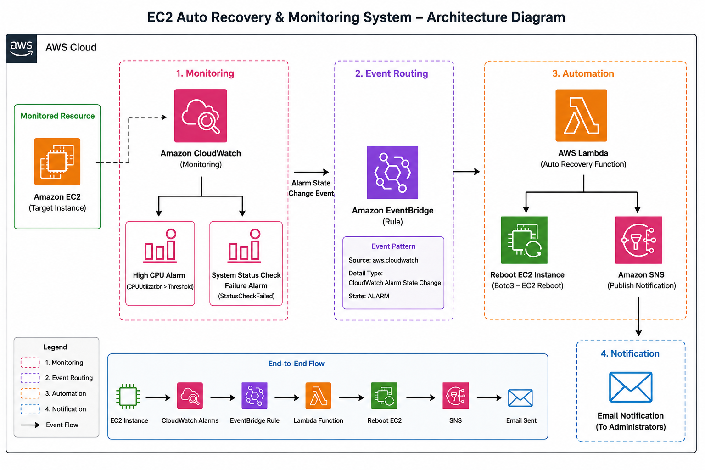
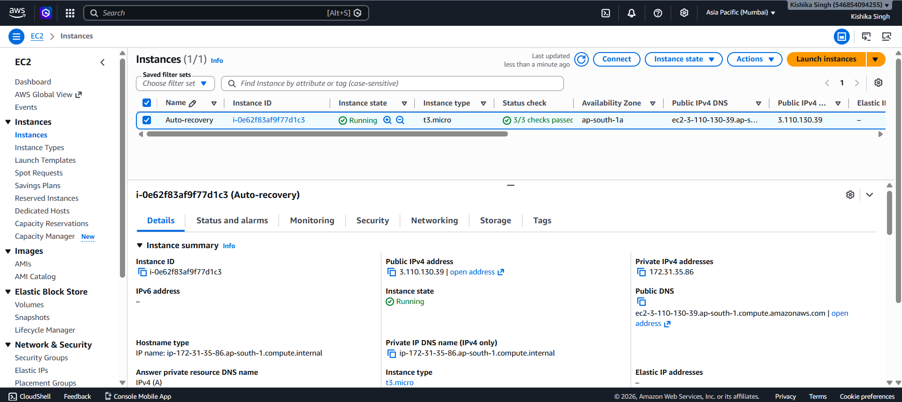
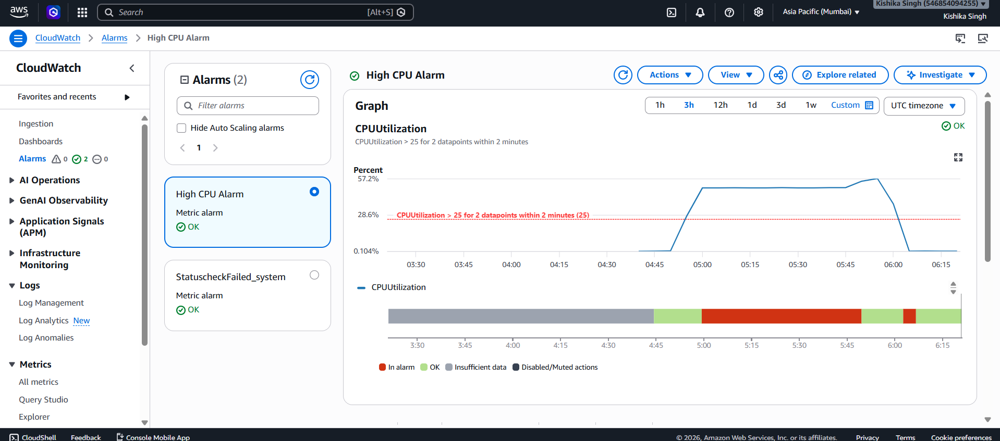
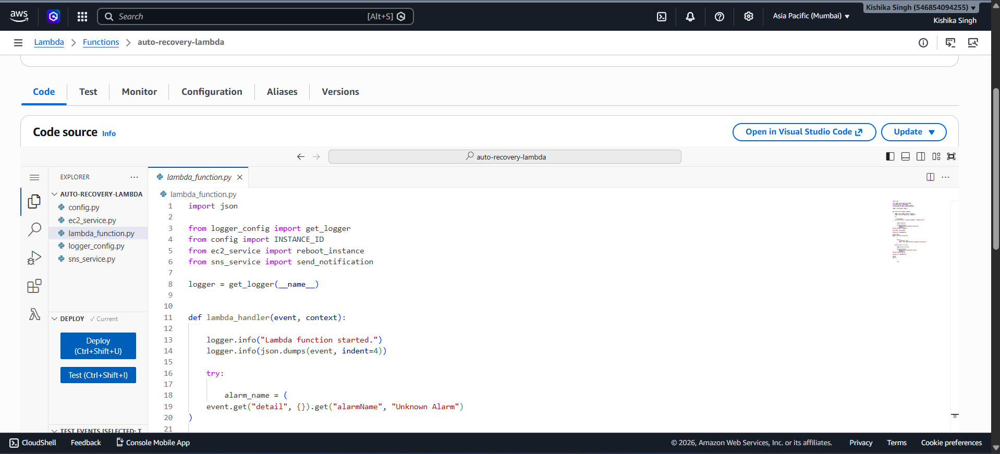
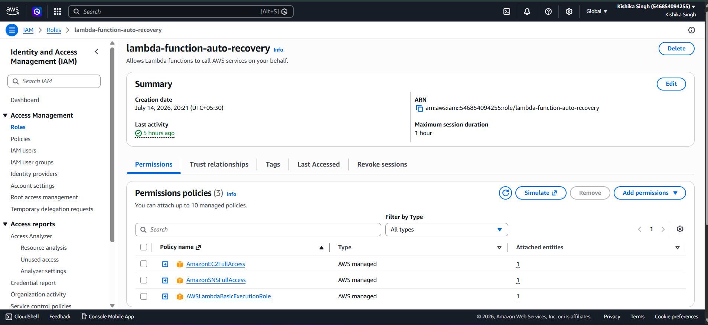
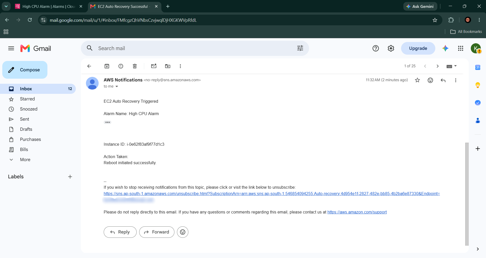
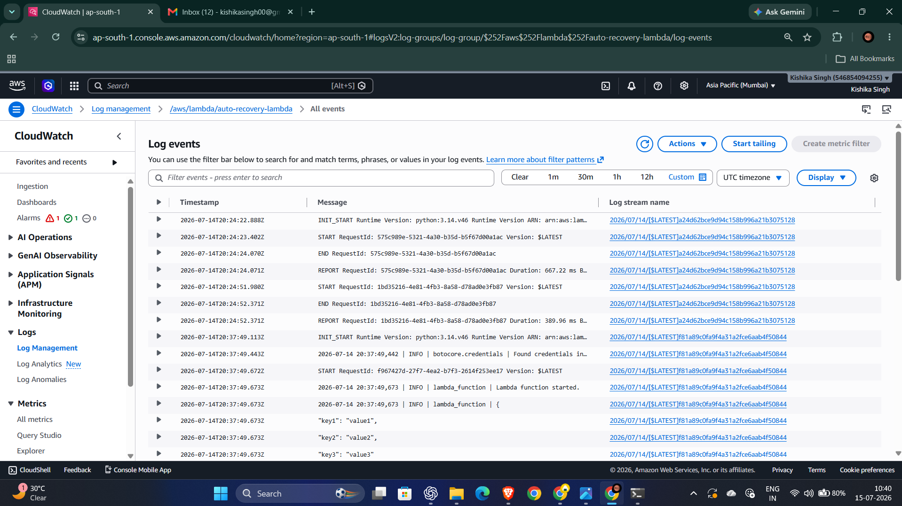

# AWS EC2 Auto Recovery & Monitoring System

> An event-driven AWS serverless project that automatically monitors an Amazon EC2 instance, detects High CPU Utilization or System Status Check failures, reboots the instance, and sends email notifications using Amazon CloudWatch, Amazon EventBridge, AWS Lambda, and Amazon SNS.

---

# Project Overview

Cloud infrastructure requires continuous monitoring to ensure high availability. Manually detecting failures and recovering instances increases downtime and operational effort.

This project automates the recovery process by continuously monitoring an EC2 instance using Amazon CloudWatch. Whenever either a **High CPU Utilization** alarm or a **System Status Check Failure** alarm enters the **ALARM** state, Amazon EventBridge captures the CloudWatch Alarm State Change event and routes it to an AWS Lambda function. The Lambda function reboots the EC2 instance using the AWS SDK (Boto3) and sends an email notification through Amazon SNS.

The project follows an event-driven serverless architecture that minimizes manual intervention and reduces recovery time while following AWS best practices.

---

# Problem Statement

Cloud-hosted applications may become unavailable due to:

- High CPU utilization
- Failed system status checks
- Temporary operating system failures
- Delayed manual intervention

Without automation, engineers must manually detect failures, investigate the issue, and reboot the instance, increasing downtime and recovery time.

---

# Architecture Diagram



---

# Solution Architecture

```text
                 +-------------------------+
                 |   Amazon CloudWatch     |
                 |      Monitor EC2        |
                 +-----------+-------------+
                             |
                             |
                 Alarm State Changes
                             |
                             ▼
                 +-------------------------+
                 |    Amazon EventBridge   |
                 +-----------+-------------+
                             |
                             ▼
                 +-------------------------+
                 |      AWS Lambda         |
                 |  Auto Recovery Logic    |
                 +-----------+-------------+
                     |                 |
                     |                 |
                     ▼                 ▼
           +----------------+    +----------------+
           | Reboot EC2     |    | Amazon SNS     |
           | (Boto3 API)    |    | Email Alert    |
           +----------------+    +----------------+
```

---

# Workflow

```text
EC2 Instance
      │
      ▼
Amazon CloudWatch
Monitors CPU Utilization
and System Status Checks
      │
      ▼
CloudWatch Alarm enters
ALARM state
      │
      ▼
Amazon EventBridge
      │
      ▼
AWS Lambda
      │
      ├───────────────┐
      ▼               ▼
Reboot EC2      Publish SNS Notification
      │               │
      ▼               ▼
Instance Restored   Email Sent
```

---

# Tech Stack

| Technology | Purpose |
|------------|---------|
| Python | Lambda Function |
| Boto3 | AWS SDK |
| Amazon EC2 | Virtual Machine |
| Amazon CloudWatch | Monitoring & Alarms |
| Amazon EventBridge | Event Routing |
| AWS Lambda | Recovery Automation |
| Amazon SNS | Email Notification |
| IAM | Secure Access Management |

---

# AWS Services Used

| AWS Service | Purpose |
|-------------|---------|
| Amazon EC2 | Target instance to be monitored |
| Amazon CloudWatch | Monitor CPU utilization and system health |
| Amazon EventBridge | Route CloudWatch Alarm events to Lambda |
| AWS Lambda | Execute recovery automation |
| Amazon SNS | Send email notifications |
| IAM | Manage secure permissions |

---

# Features

- Automatic EC2 reboot on failure
- High CPU utilization monitoring
- System Status Check Failure monitoring
- Event-driven serverless architecture
- Email notifications using Amazon SNS
- Environment variable configuration
- Modular Python codebase
- IAM Role authentication
- No hardcoded AWS credentials

---

# Project Screenshots

The following screenshots demonstrate the successful implementation and testing of the project.

## EC2 Instance



---

## CloudWatch Alarms

<!-- Add CloudWatch Alarm Screenshot -->


---

## AWS Lambda Function



---

## IAM Role Permissions

<!-- Add IAM Role Screenshot -->


---

## Successful Email Notification

<!-- Add Email Screenshot -->


---

## Lambda CloudWatch Logs

<!-- Add CloudWatch Logs Screenshot -->


---

# Prerequisites

- AWS Account
- Amazon EC2 Instance
- Amazon SNS Topic
- Confirmed Email Subscription
- AWS Lambda Function
- IAM Role
- CloudWatch Alarms
- Amazon EventBridge Rule
- Python 3.x

---

# Deployment Steps

| Step | Description |
|------|-------------|
| 1 | Launch an EC2 Instance |
| 2 | Create an SNS Topic |
| 3 | Confirm Email Subscription |
| 4 | Create the Lambda Function |
| 5 | Attach the required IAM Role |
| 6 | Configure Environment Variables |
| 7 | Deploy the Lambda Code |
| 8 | Create CloudWatch Alarms |
| 9 | Configure the Amazon EventBridge Rule |
| 10 | Test the complete event-driven workflow |

---

# Environment Variables

| Variable | Description |
|----------|-------------|
| `INSTANCE_ID` | EC2 Instance ID |
| `SNS_TOPIC_ARN` | Amazon SNS Topic ARN |
| `AWS_REGION` | AWS Region |
| `LOG_LEVEL` | Logging Level |

---

# Lambda Workflow

```text
Lambda Triggered
        │
        ▼
Read Environment Variables
        │
        ▼
Extract Alarm Details
        │
        ▼
Reboot EC2 Instance
        │
        ▼
Publish Amazon SNS Notification
        │
        ▼
Return Success Response
```

---

## End-to-End Testing

```text
High CPU Alarm / System Status Check Failure
                    │
                    ▼
            CloudWatch Alarm
                    │
                    ▼
          Amazon EventBridge
                    │
                    ▼
              AWS Lambda
                    │
                    ▼
              Reboot EC2
                    │
                    ▼
           Amazon SNS Email
```

| Component | Status |
|-----------|--------|
| High CPU Alarm | Passed |
| System Status Check Alarm | Passed |
| EventBridge Trigger | Passed |
| Lambda Execution | Passed |
| EC2 Recovery | Passed |
| SNS Email Notification | Passed |

---

# Debugging

## Issue: Lambda Was Not Invoked by CloudWatch Alarm

During end-to-end testing, both the **High CPU Utilization** alarm and the **System Status Check Failure** alarm successfully transitioned from **OK** to **ALARM**. However, the EC2 instance was not rebooted and no email notification was received.

### Investigation

The following components were verified:

- CloudWatch Alarm configuration
- Amazon SNS Topic and email subscription
- Lambda execution role permissions
- Lambda CloudWatch Logs

Although the alarms were triggered successfully, no Lambda invocation logs were generated, confirming that the Lambda function was never executed.

### Root Cause

The CloudWatch alarms were not connected to the Lambda function. Since no Amazon EventBridge rule existed, the **CloudWatch Alarm State Change** events were never forwarded to the Lambda function.

### Resolution

An Amazon EventBridge Rule was created with the following configuration:

| Property | Value |
|----------|-------|
| Source | `aws.cloudwatch` |
| Detail Type | `CloudWatch Alarm State Change` |
| Alarm State | `ALARM` |
| Target | AWS Lambda Function |

The EventBridge rule listens for all CloudWatch alarms that transition to the **ALARM** state, allowing the Lambda function to respond to both **High CPU Utilization** and **System Status Check Failure** alarms.

```text
High CPU Alarm / System Status Check Failure
                    │
                    ▼
            CloudWatch Alarm
                    │
                    ▼
          Amazon EventBridge
                    │
                    ▼
              AWS Lambda
              │         │
              ▼         ▼
         Reboot EC2   Amazon SNS
              │         │
              ▼         ▼
      Instance Restored  Email Notification
```

After configuring the EventBridge rule, the complete recovery workflow executed successfully.

---

# Future Improvements

- Use EC2 Auto Recovery instead of reboot where applicable.
- Support monitoring and recovery of multiple EC2 instances.
- Implement Infrastructure as Code using Terraform or AWS CloudFormation.
- Configure Dead Letter Queue (DLQ) for failed Lambda invocations.
- Add CloudWatch Dashboards for centralized monitoring.
- Integrate AWS Systems Manager for diagnostics.
- Implement structured JSON logging.
- Add AWS X-Ray for request tracing.

---

# Learning Outcomes

This project provided practical experience with:

- Event-Driven Architecture
- AWS Lambda
- Amazon CloudWatch
- Amazon EventBridge
- Amazon SNS
- Amazon EC2
- IAM Roles and Policies
- Environment Variables
- Boto3
- Serverless Computing
- Infrastructure Monitoring
- Cloud Automation
- AWS Troubleshooting and Debugging

---

# Author

**Kishika Singh**

Cloud Computing | AWS | Python | Serverless | Infrastructure Automation
